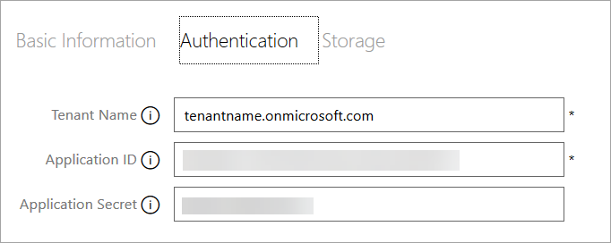

# Setup your Azure cloud subscription in OneLearn Lab on Demand

[Return to Cloud Slice Guide](../cloud-slice.md)

To add a Cloud Subscription Pool to OneLearn Lab on Demand (LOD), perform the following steps:

1. Navigate to the <a href="https://labondemand.com" target="_blank">OneLearn Lab on Demand portal</a> and sign in.

1. Open the **Subscription Pools** section on the Cloud Services tile.

   

1. Click **Create Cloud Subscription Pool** to create a new cloud subscription pool in LOD.

   

1. Select **Azure** from the **Cloud Platform** drop-down menu. 

1. Select **Manual** from the **Pool Type** drop-down menu. 

1. Select **Shared** from the **Subscription Mode** drop-down menu. 

1. Assign values to **Name**, **Organization**, and any optional fields you want to use. 

   |Field Name|Description|
   |----|----|
   |Name&nbsp;(required)|The name of the Cloud Subscription Pool being created.|
   |Description|The Description should describe the capabilities or the intent of the Subscription Pool.|
   |Organization&nbsp;(required)|The organization in LOD where the managed Cloud Subscription pool will be used.|
   |Enabled|This checkbox determines if the Cloud Subscription Pool is enabled or disabled.|
   |Custom&nbsp;subscription&nbsp;unavailable&nbsp;message|This message will be presented to users if they try to launch a lab and a subscription is unavailable. If this field is blank, the default message will be used.|
   |Enable&nbsp;Health&nbsp;Checks&nbsp;|Enable health checks across all subscriptions in this pool. LOD will periodically check the subscription for configuration errors and other potential problems.|
   |Health&nbsp;Check&nbsp;Interval&nbsp;|Health check frequency. The health checks for each subscription will be completed at the specified interval.|
   |Enabled&nbsp;|Enables the subscription pool for use. Unchecking this box will disable the subscription pool.|)

1. On the **Authentication Tab**, assign values to **Tenant Name**, **Application ID**, and **Application Secret**. 

   |Field Name|Description|
   |----|----|
   |**Tenant&nbsp;Name**|The name of the tenant used for deployment of Cloud Slices in your cloud service.|
   |**Application&nbsp;Id**|The identifier that uniquely identifies the client used to manage your cloud service subscription.|
   |**Application&nbsp;Secret**|The secret used to authenticate your client id in your cloud service subscription.|

1. Click **Save** to create the Cloud Subscription Pool.

<!--
   You may also provide values for the following optional fields:

   |Tab|Field Name|Description|
   |----|----|----|
   |**Basic Information**|**Description**|Text used to describe the managed Cloud Subscription that you are setting up.|
   ||**Owner&nbsp;Name**|The name of the the Cloud Subscription Owner|
   ||**Owner&nbsp;E-mail**|The e-mail address of the the Cloud Subscription Owner|
   ||**Expires&nbsp;After**|The date that the Cloud Subscription will expire.|
   ||**Enabled**|Indicates whether or not the managed Cloud Subscription is enabled.|

   If you are using managed virtual machines in your cloud platform, you may also provide values for the following fields:

   |Tab|Field Name|Description|
   |----|----|----|
   |**Storage**|**Template&nbsp;Storage&nbsp;Account**|The name of a storage account inside of the Template Storage Resource Group where the template VHDs may be found. This should either be provided to you or, if you set it up yourself, this is the name of the storage account that you created in the previous task.|
   ||**Template&nbsp;Storage&nbsp;Resource&nbsp;Group**|The name of a Cloud Resource Group in the managed Cloud Subscription that contains template VHDs that you would like to copy into a lab during its deployment. This should either be provided to you or, if you set it up yourself, this is the name of the resource group that you created in the previous task.|
   ||**Template&nbsp;Storage**|The name of a container in the Template Storage Account where the template VHDs may be found. This should either be provided to you or, if you set it up yourself, this is the name of the template VHD container that you created in the previous task.|
   ||**Instance&nbsp;Storage&nbsp;Account**|The name of a storage account inside of the Instance Storage Resource Group where template VHDs will be copied when a Cloud Slice lab configured to use those template VHDs is deployed. This should either be provided to you or, if you set it up yourself, this is the name of the storage account that you created in the previous task. You may use the same storage account as the one used for the Template Storage Account field.|
   ||**Instance&nbsp;Storage&nbsp;Resource&nbsp;Group**|The name of a Cloud Resource Group in the Cloud Slice where template VHDs will be copied when a Cloud Slice lab configured to use those template VHDs is deployed. This should either be provided to you or, if you set it up yourself, this is the name of the resource group that you created in the previous task. You may use the same resource group as the one used for the Template Storage Resource Group field.|
   ||**Instance&nbsp;Storage**|The name of a container in the Instance Storage Account where template VHDs will be copied when a Cloud Slice lab configured to use those template VHDs is deployed. This should either be provided to you or, if you set it up yourself, this is the name of the template VHD container that you created in the previous task.|

1. Click **OK** to create the Cloud Subscription. The Cloud Subscription will be saved and associated with the Cloud Subscription Pool that was created during previous steps.

1. If desired, repeat the three previous steps for each managed Cloud Subscription that you want to add to the pool.

#### Below are some screenshots showing what the Cloud Subscription might look like when you have finished.

-->

[Back to top](#setup-your-azure-cloud-subscription-in-onelearn-lab-on-demand)
