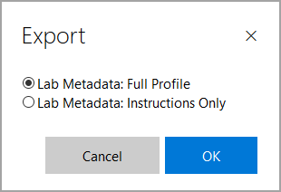
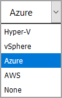
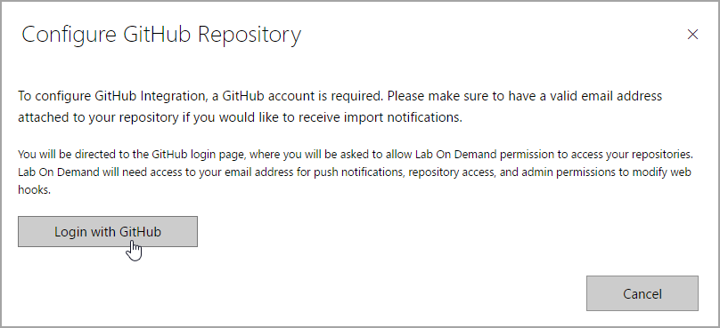
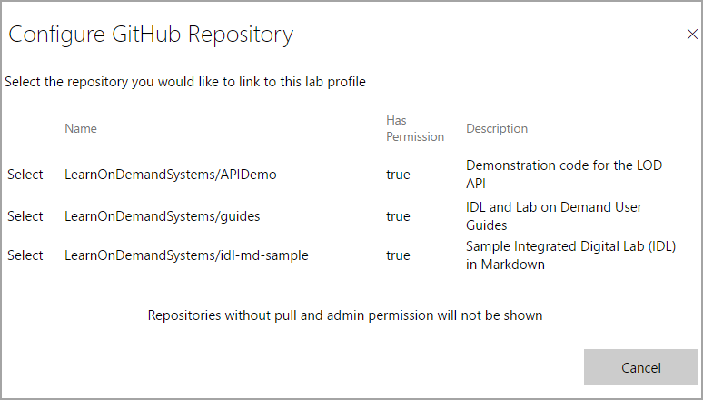
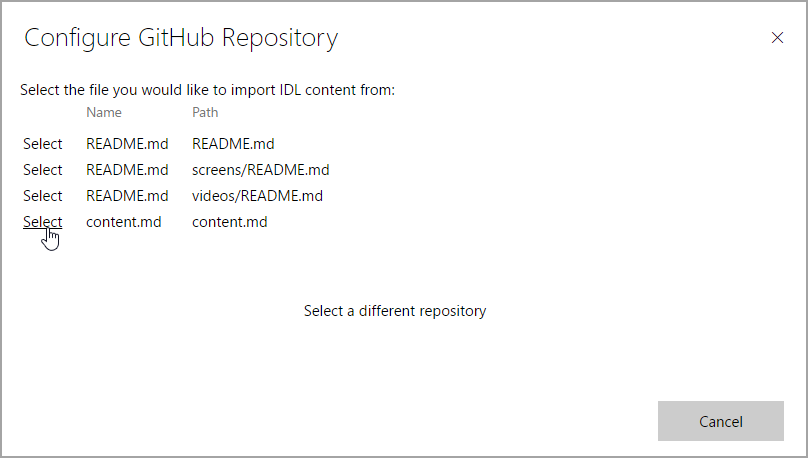
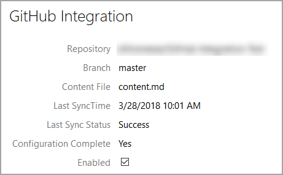

# Learn on Demand Systems GitHub Integration Guide 

This guide describes how to select a GitHub repository as the source of
Integrated Digital Lab eXperience (IDLx) or IDL (legacy) content for a Lab on Demand (LOD) lab profile, and why you would want to do so.

## Intended Audience

This guide assumes that the reader:
- has a developer account in LOD with sufficient permissions to create IDLx or IDL (legacy)
content and modify specific properties of a lab profile;
- has an account on GitHub;
- has existing labs hosted in LOD;
- has a help desk support contract to pay for additional custom contract work
(if desired).

Further, this guide assumes the reader either has access to an existing GitHub
repository containing lab content or can create one following the steps outlined
in this guide.
 
# GitHub Integration

Lab on Demand now allows you to integrate a GitHub repository into a lab and use
that repository as the source of Integrated Digital Lab eXperience (IDLx) or IDL (legacy) content for that
lab. This integration provides the following benefits to lab content authors:

1. **Offline editing** - With the GitHub integration, content is created/edited
as part of a structured text document
([Markdown](https://en.wikipedia.org/wiki/Markdown) file), that can be edited
offline using one of the many free or commercial Markdown editors that are
available for all mainstream platforms/devices being used today, including
Windows, macOS, Linux, iOS, and Android.
1. **Revision control** - GitHub natively supports revision control, which means
you get revision control for your content in labs that leverage the GitHub
integration feature. This allows you to compare revisions, roll back changes,
view revision history, etc.
1. **Multi-author support** - By managing your content in a lab that leverages
the GitHub integration feature, you can support multiple content authors
contributing to the content for one lab at the same time.
1. **Readability** - A Markdown IDL document is a text file that reads much like
a lab manual would.
1. **Simplicity** - Markdown is structured text without tags. Editing text files
is easy, and text file editing can be done more efficiently than lab content
editing in a user inteface. Plus features like search and replace in text files
bring new capabilities that were not previously available to content authors.
1. **Broad adoption** - Markdown is being adopted all over the place – from
creation of documentation at Microsoft (MSDN docs, PowerShell Help files, Word
documents, etc.) to defining blog content/pages (WordPress, Ghost, others) to
Slack channels (you can use Markdown directly inside of Slack messages), and
much, much more. This opens up opportunities to do other interesting things with
your lab content.
1. **Tooling** - There are some great libraries out there to convert from
Markdown to HTML such as Markdig. Markdig is very fast and includes extra
goodies like AST generation, which makes for much easier Markdown conversion to
other content by using the Visitor pattern.

Choosing to leverage this feature means moving all of your content management
(including editing) for a lab into GitHub. Once you have enabled this
integration for a lab, the content in that lab will automatically be updated
based on the the latest changes you make to your content in GitHub. 

There is a small learning curve to overcome with GitHub and Markdown such as
syntax and structure; however, the benefits you will realize once you have
learned how to write your lab content in Markdown and once you have stored those
files in GitHub are well worth the effort. For more information on Markdown, see our [Markdown User Guide](https://raw.githubusercontent.com/LearnOnDemandSystems/docs/master/guides/idl2/markdown-user-guide.md)

## Getting started

As mentioned earlier, you need a GitHub account to integrate GitHub with LOD. If
you do not have one yet, go to [GitHub](https://github.com) and sign up now
before continuing further with this guide.

> [!KNOWLEDGE] *If Git, GitHub, and cloning a repository are new concepts to you, explore the
links in the [Resources](#resources-for-learning-more-about-git-and-github)
section at the end of this guide. Those resources will be very helpful as you
learn how to use these highly useful tools.*

You will also need a GitHub repository containing a .md file that defines the
lab content in our format. If you are creating content for a lab that doesn’t
have any content yet, refer to the **Authoring Lab Content from Scratch**
section below to get started. If you are moving content for a lab that has
content into GitHub, see the **Copying Existing Lab Content into GitHub**
section below to start that way instead.

### Authoring Lab Content from Scratch

If you are writing IDLx content for a lab that does not yet have any content in LOD,
start by doing the following:

1. Create a new GitHub repository where you will manage your lab content.
1. Create a folder to store your lab instructions and any other files used in the lab.
1. Create a new file in the folder called content.md.
1. If you want to store screenshots for your lab in GitHub, create a *media*
folder, inside of the folder created on step 2.
1. If you want to store videos for your lab in GitHub, these can be stored in the *media* folder as well.

> [!KNOWLEDGE] If you would like more information about authoring labs with IDLx, see our [IDLx Authoring Guide](https://raw.githubusercontent.com/LearnOnDemandSystems/docs/master/guides/idl2/idlv2-authoring-guide-and-best-practice.md).

If you are writing IDL (legacy) content for a lab that does not yet have any content in LOD,
start by doing the following:

1. Create a new GitHub repository where you will manage your lab content.
1. Create a new file in the root of your GitHub repository called content.md.
1. Copy the contents of the [content.md template](https://raw.githubusercontent.com/LearnOnDemandSystems/idl-md-template/master/content.md)
into your content.md file.
1. If you want to store screenshots for your lab in GitHub, create a *screens*
folder at the root of your GitHub repository.
1. If you want to store videos for your lab in GitHub, create a *videos* folder
at the root of your GitHub repository.

> [!KNOWLEDGE] The content.md file that you copied is full of step-by-step TODO comments to
help you build out your content in the content.md file for your lab. Once you
have finished adding your first exercise and task to the content.md file, save
your changes to your GitHub repository, and then proceed to the [Integrate
GitHub with a LOD Lab Profile](#integrate-github-with-a-lod-lab-profile)
section. You can resume content editing later once you have your integration set
up.

### Copying Existing Lab Content into GitHub

If you have a lab that already has IDLx or IDL (legacy) content in LOD, you can use GitHub to
manage that content as well. To get this set up you must do the following:

1. In Lab on Demand, navigate to the lab profile whose content you want to
manage in GitHub.

1. Click **Export**.

    

1. In the **Export** window, select **Lab Metadata: Instructions Only** and click
**OK**.

    

1. In the **Save** dialog, navigate to the location where you want to save the
archive file.

The archive file that is saved will contain a content.md file as well as folders
for screenshots (screens) and videos (videos) if either of these were present in
the original lab profile. Add these files to the GitHub repository that you want
to use to manage your lab content, and then proceed to the [Integrate GitHub
with a LOD Lab Profile](#integrate-github-with-a-lod-lab-profile).

### Integrate GitHub with a LOD Lab Profile

At this point you should have a GitHub repository that contains a Markdown
document defining your lab instructions, along with any screenshots and
video files you decided to add to the repository in the media
folder. 

To integrate the Markdown document in your GitHub repository with a lab profile,
navigate to the lab profile you want to integrate with. Then follow these steps:

1. From your lab profile page, click **Edit**.

1. Select the **Virtualization Platform** that your lab will use. If your lab does not require virtualization, then **select None**.

    

1. If you have not enabled it already, check the **Instructions** checkbox, on the Basic Information tab, 
and then save the lab profile. (Use Legacy Format only for IDL (legacy) labs)

    

2. Click on the **Cloud tab**, then click **Configure GitHub
Repository**.

    

3. The Configure GitHub Repository dialog with *Login with GitHub* link will
open. Click **Login with GitHub**.

    

4. If you are not logged into GitHub, you be will prompted to login. Use the
controls in the GitHub login page to log into your GitHub account. At this point
you should be logged into a GitHub account that has a repository containing lab
content you want to integrate into the lab profile.
5. Once you are logged into GitHub, if you have not done this before you will be
asked to authorize Lab on Demand to have access to your GitHub account. This
access is only used to create a webhook so that LOD can be notified whenever the
content in your GitHub repository changes. Click **Authorize application** to
continue with the integration.

    

    > [!KNOWLEDGE] 
    > Once you have authorized Lab on Demand to have access to your GitHub account,
    > if you also want Lab on Demand to be able to integrate with a repository in a
    > GitHub organization that you are a member of, you will have to submit a request
    > to your organization to authorize that application. 
    > 
    >To submit that request; 
    > - use
    > your web browser to navigate to GitHub.com, and log in. 
    > - Click the account
    > icon/image on the top right corner
    > - Click **Settings**. In your personal
    > settings, 
    > - Click **Authorized OAuth Apps** and then click **LabOnDemand** in the
    > list of apps that is shown. 
    > - Scroll down to **Organization access** in the
    > LabOnDemand app settings, and click **Request** next to your organization. 
    >
    > This
    > will send a request to your organization which, once approved, will enable
    > access for Lab on Demand to integrate with repositories in your organization.
6. At this point you will be presented with a list of repositories that are
associated with your GitHub account. Click **Select** next to the repository
containing the lab content that you want automatically synchronized into the lab
profile. 

    > [!KNOWLEDGE] While you are viewing the list of your repositories, you can
preview a repository before selcting it by clicking on the name of that
repository. That will open the GitHub repository in a new web browser window.
Also note that if no markdown content files are present in the repository, you
will be prompted to select a different one.

    

    > [!ALERT] When you complete the following step, any existing content in your
lab profile will be overwritten, and anything lost will be unrecoverable. Under
normal circumstances, that is ok because the content you are importing is the
export of the content that is in the lab, so you won't lose a thing. You should
be careful though, because you don't want to import the wrong content into a lab
that contains content that is not backed up/exported elsewhere first; otherwise,
you will lose that content.

8. After choosing your repository, you need to identify the markdown file that
defines the lab content within that repository. Click **Select** next to the
markdown file to use as the source of your lab content. Note that you can
preview a markdown file before selecting it by clicking on the name of that
file. If you do this, the markdown file will open in a new browser window.

    

9. Once you select the Markdown file that defines the lab content, LOD will
process synchronize all lab content referenced by that markdown file into the
lab profile. At any point that the GitHub content changes, the lab profile will
be updated automatically.
10. Once the synchronization process is complete, you will have completed your
integration. Click **Close** to finish the Integration wizard.

    

11. Notice that your lab profile now shows that content is integrated from your
GitHub repository. Click the **Save** button at the bottom of your lab profile
window to exit the lab profile editor.

    

### Editing Integrated Lab Content

Once a lab is integrated with GitHub, if you are in LOD and want to change the
lab content, you can click on the GitHub repository link on the **Cloud** tab.
This will bring you to GitHub and the content.md file. You can also change the
lab content directly in GitHub without using the LOD UI. Third, you can use a
local git repository that is synchronized with your GitHub repository. In either
of these cases, LOD will automatically synchronize any changes you make as they
are committed into your GitHub repository. These changes will be immediately
available to users who launch that lab from that point on.

> [!KNOWLEDGE] When an IDLx lab Profile is integrated with GitHub, and then the integration is later removed, the content will not be affected, and will be managed through LOD. 
When an IDL (legacy) Lab Profile is integrated with GitHub, IDL Studio options are
disabled. If you remove the integration with GitHub, the IDL (legacy) content will remain
but it will now be treated as regular IDL content managed with the IDL Studio. 

## Manual synchronization of Markdown content

If you do not want to use a template to author your lab using Markdown, you can write free-form instructions using Markdown. For more information, see our [IDLx Authoring Guide](https://raw.githubusercontent.com/LearnOnDemandSystems/docs/master/guides/idl2/idlv2-authoring-guide-and-best-practice.md), where you will find Markdown syntax explanations, as well as best practices for building labs with IDLx.

If you do not want to integrate with GitHub but still want to leverage the
benefits of Markdown, you can create a .md file that matches our template and
manually import that content. You can also package that markdown file up inside
of an archive with screens and/or videos folders and import that archive. If you
import a single markdown file, the import method will not include screenshots or
videos. If you import an archive, the import will include whatever screenshots
or videos you have in your archive, along with the content.

> [!ALERT] No automatic synchronization of content occurs with this method. You
must manually re-import your Markdown file or archive every time you have new
content added to it.

### Importing Markdown content into Lab on Demand

To import a .md file into a lab profile , follow these steps:

1. Click **Edit** to edit your lab profile.

    

1. If you have not enabled it already, check the **Instructions** checkbox, on the Basic Information tab
and then **click Save**, to save the lab profile.

    

1. On the Lab Profile Details page, click **Import**.

    

1. Select **Instructions** and click **OK**.

    

1. On the **Import IDL Content** page, click **Browse**, then navigate to and
select your .md file or an archive, and click **Open**.

1. Click **Import** to append the content at the end of any existing content in
the lab. If you want to replace the current content that is in the lab, check
the **Replace Existing Content** check box.

    

1. Once the content has been imported, navigate back to the Lab Profile Details page by clicked **Details**, and then click on **Lab Manual** to view the lab
manual and verify that the content imported correctly.

    

# Resources for learning more about Git and GitHub

- [Mastering Markdown](https://guides.github.com/features/mastering-markdown/)

(a GitHub Guide to learning Markdown)
- [Git Tutorial](https://try.github.io/) (a 25-minute online sandbox where you
can learn Git)

- [Pro Git](https://git-scm.com/book/en/v2) (a free, open-source book -- highly
recommended!)

- [GitHub Bootcamp](https://help.github.com/categories/bootcamp/) (A set of
learning resources to get more out of GitHub)

