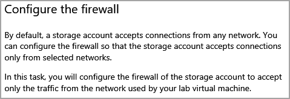
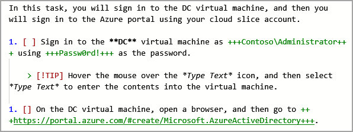
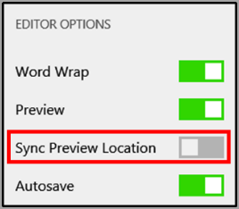
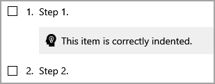
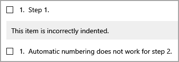
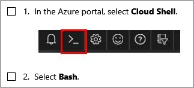
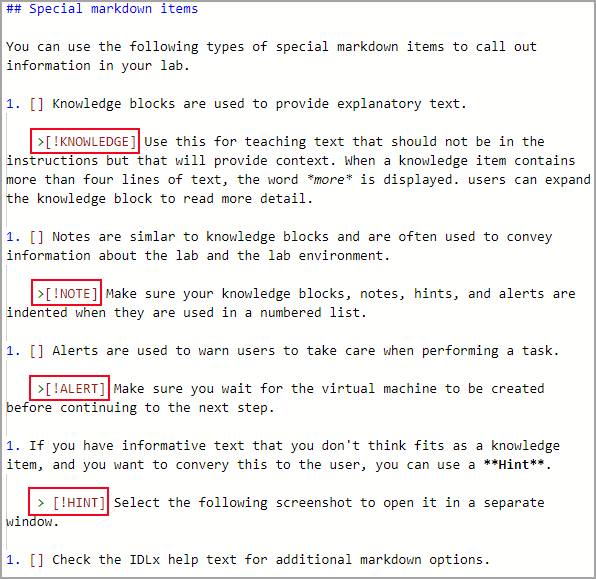
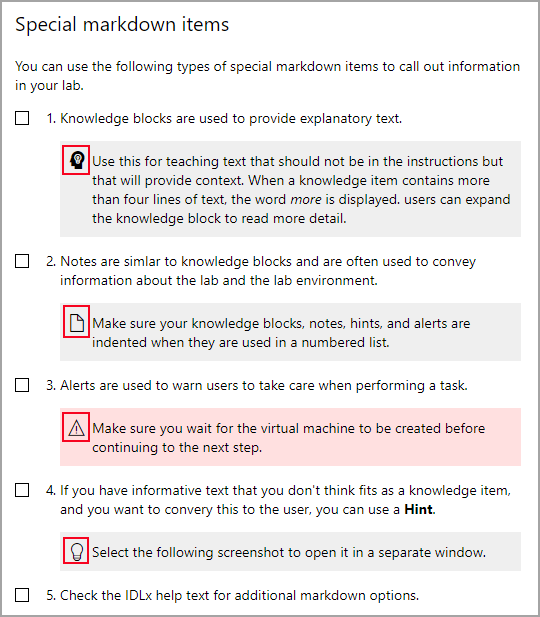
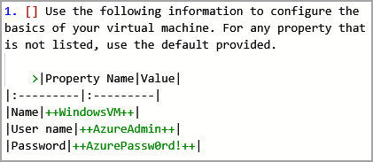
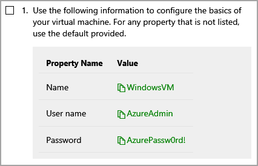

# IDLx Lab Development Best Practices

This best practices guide is intended for lab authors who are creating labs using the Integrated Digital Lab eXperience (IDLx) platform. IDLx provides lab authors with the ability to enhance the user experience with contextual learning material and graphics while keeping a user focused on the tasks in the lab.

This guide will provide you with best practices and tips for working with some of the most commonly used lab development features of the IDLx.

## Language and documentation best practices

This section contains some best practices and tips for writing a successful lab.

## Write engaging instructions

Engaging lab steps should be clear and easy for users to follow. Using a consistent style will help to keep users focused. The following writing best practices will help you to keep users engaged:

-   Use the structure "where, what, why".

-   Use one sentence per step.

-   Provide context to help users understand how the technology can benefit them.

### Where, what, why

A user may only read the first part of a sentence. If you start with the explanation of what you want the user to do, and then write the instructions at the end of the sentence, many users will only read a few words in your explanation, and then they'll try to figure out how to perform the task on their own. This often leads to errors and frustration. By using the "where, what, why" structure, you'll ensure that the key instruction is conveyed first before you provide the explanation.

-   **Where**: If the user must move to a different location on the screen, tell the user where to perform the task before stating what the user should do.

-   **What**: State what the user should do. Your directions should be very specific, with no options. Provide specific user names, passwords, and information messages.

-   **Why**: Explain why the user is performing the task unless the purpose of the task is very obvious. This helps the user to understand the benefit of the task and why it's important to them.

#### Examples

-   In Cloud Shell, run the following command to create a key pair.

-   Select **Mount Storage** to mount the storage using the file share named shell.

-   In the Cloud Shell region, select **East US**.

-   On the DemoVM blade, select **Connect**, and then download the RDP file.

### Use one sentence per step

Lab instructions should only contain one sentence per step. This is particularly important in IDLx environment.

Visually, each numbered step is a task that your user must complete. You can combine two short actions into one step if they are both part of the same task.

-   Always use complete sentences.

-   Use a knowledge block in IDLx if you have additional information that you want to convey to users. This provides a visual separation between your instructional step and the additional information.

### What's in it for me

Your labs should always provide enough context to answer the user's question: "What's in it for me?" This means providing clear, concise instructions that also offer an explanation so that users understand how to apply what they're learning to their real-world environment.

-   Include the reason they're performing the step.

-   Add knowledge blocks and notes to provide additional context.

-   Use URLs to take the user to additional information about your lab topic.

## Follow language best practices

You should strive to use clear, consistent language in your lab. This section contains some language best practices and some examples for you to follow in your labs.

### Use neutral verbs

Where possible, use neutral verbs when there are different ways to perform a task.

#### Examples

-   Open **File Explorer**.

-   Open **Windows PowerShell**.

-   Display the **MyStorage** storage account.

-   Display the **CreateTable** method.

### Think about your intended audience

The language you use and the detail you provide may depend on your intended audience. If your audience should know how to open File Explorer or Windows PowerShell, let them use their preferred method. On the other hand, if you are creating an introductory level lab, your audience may need additional guidance, and you'll want to guide them through a specific way of performing the task.

#### Examples for advanced level labs

-   Open **File Explorer**.

-   Display the **MyStorage** storage account.

-   Open the **Azure Marketplace**.

#### Examples for introductory level labs

-   On the taskbar, select **File Explorer**.

-   On the left navigation bar, select **All resources**, and then select **MyStorage**.

-   Select **Create new resource** to open the Azure Marketplace.

### Prompt users to save changes

You should always prompt users to save changes, confirm configuration updates, or close windows that are no longer needed. In a service-based environment where the user interface changes frequently, avoid using terms like **select OK** or **select Save**. Those elements may not be the same in a few months, and then you'll need to update your instructions.

#### Examples

-   In the IP address range, enter **1.1.1.0**, and then save your changes.

-   In the Page title, enter **My Title**, clear the **Enabled** check box, and then confirm the updates.

## Structure your lab

Before you begin to write the steps for your lab, plan the lab structure. Think about the tasks you want the users to perform. A task is a defined goal that a user must achieve. Tasks contain a series of steps that a user must perform in order to achieve the goal.

If you are writing a longer lab, you may want to use exercises as containers for your tasks. An exercise will have a larger goal that is the result of performing multiple tasks.

- Begin each task with an introductory sentence that states the outcome of the task.

    

    _Provide some background or context, and then state what you will do in the task._

- This is your opportunity to add some context to the task. If possible, add one or two sentences that explain the technology used in the task. You want your user to understand why the technology is used.

#### Best practices for writing tasks

-   Use an introductory sentence to define the outcome of your task.

-   Create a heading that calls out the purpose of the task.

-   Create the steps that the user will follow to achieve the goal.

-   Use an exercise as a container for multiple tasks if your lab has a combination of tasks that go together to achieve a larger goal.

-   If your exercise or task heading contains the word *and*, review the objectives. You may be trying to combine two tasks or two exercises into one.

# Best practices for working in the IDLx environment

This section contains tips for working with markdown and content formatting in the IDLx environment.

## Define headings for your content

A good heading tells users what they will do in an upcoming task or exercise. When you are writing your headings, start with a verb, and use articles like "*a"* and "*the"*.

The IDLx environment provides markdown characters that define the format of your headings. Each heading style is defined by a **\#** symbol in IDLx markdown.

\#Heading 1 

-   Use the Heading 1 style for the opening title of your lab or for an exercise or task heading that begins on a new page.

     

    _Page break and Heading 1 markdown_

    

    _Heading 1 format in the UI_

-   Text that uses the Heading 1 style will display the heading text in the navigation buttons at the bottom of a page, as long as the heading contains a maximum of 40 characters.

    

    _Navigation button_

-   If you are following the [Microsoft Writing Style Guide](https://docs.microsoft.com/en-us/style-guide/welcome/), use sentence case for your headings.

\##Heading 2

- Use Heading 2 style for tasks that are all on the same page.

   

    _Heading 2 markdown_

    

    _Heading 2 format in the UI_

-   You can also use this style for exercises when you do not want the name of the exercise displayed on the navigation buttons at the bottom of a page.

\###Heading 3

-   Use the Heading 3 format for tasks that are part of an exercise when the exercise uses a Heading 2 format.

Although there are other heading levels available, if you find yourself using, them, look at the structure of your lab to see if your exercises or tasks could be arranged differently.

#### Best practices for writing headings

-   Headings should begin with a verb.

    -   Create an account

    -   Configure the firewall.

-   Don't use a period at the end of a heading.

-   Capitalize the first word in the heading, but do not capitalize other words in the heading unless you are referring to a product that is capitalized in the product documentation.

-   Make sure your heading describes the outcome of the task.

## Create copyable text

Everything that you want a user to enter into a text box, a configuration setting, or a code window should be configured to use copyable text. This saves time for users, prevents typing errors, and allows users to focus on the learning concepts of your lab rather than on entering text.

There are two available options for copyable text: *Copy to clipboard* and *Type Text*. The markdown syntax and the display of the two options is slightly different, but the benefit to the user is the same.

#### Copy to clipboard

The Copy to clipboard feature in the markdown allows you to define text or code items that a user can copy from the manual and paste into a web browser in the lab environment. To use the Copy to clipboard feature, surround the ++copyable text++ with two + signs.

 

_The Copy to clipboard feature configured in IDLx markdown_

_Copy to clipboard displayed in the UI_

#### Type Text 

The Type Text feature in the markdown is used in a virtual machine environment and allows a user to enter text or code items directly into a virtual machine. To use the Type Text feature, surround the +++copyable text+++ with three + signs.

 

_The Type Text configured in IDLx markdown_

_Type Text displayed in the UI_

## Create numbered steps and bullets

Numbering makes the steps in a task easier for a user to read. In a step-by-step lab, you can use the automatic numbering feature in IDLx. Numbered steps can also use checkboxes to help users track their progress through the lab.

### Define numbered lists

-   Use the number 1 plus a period for each step in the numbered list.

-   The markdown will display a list of steps that begin with the number 1 as an automatically numbered list.

-   Use brackets \[\] to display a checkbox.

-   Users can select the checkbox to track their progress through a lab.

     

    _Numbered list in IDLx markdown_

    

    _Numbered list displayed in the UI_

### Define bulleted lists

-   Use bullets for an unordered list.

-   Bullets are useful for informational text, but are harder for a user to follow in a step-by-step lab.

     

    _Bulleted list in the markdown_ 

    

    _Bulleted list displayed in the UI_

#### Tips for working with automatic numbering

- IDLx displays both the markdown and a preview of the user experience. To ensure that you are viewing a preview of the user experience, in the IDLx editor, on the toolbar, select **Options**, and then turn off **Sync Preview Location**.

     
    
    _IDLx Editor Options_

- Always check your automatic numbering in the preview to make sure that your markdown is correct. If you are creating your markdown in a markdown editor outside of IDLx, make sure that you paste your markdown into the IDLx editor, and then review your content in the preview window, making any adjustments needed to correct your markdown.

- An extra space before the number 1 will cause the numbered list to display as a second level number.

     
    
    _Second level number in IDLx_ 

     
    
    _Second level number displayed in the UI_

- When you use learning features like notes or knowledge items or images between steps in a numbered list, you must indent the learning item in order to maintain the automatic numbering.

     
    
    _Correctly indented knowledge block displayed in the UI_ 

     

    _Correctly indented knowledge block in IDLx_

     
    
    _Incorrectly indented knowledge block displayed in the UI_

     

    _Incorrectly indented knowledge block in IDLx_

## Format your document

A good IDLx lab should contain text and graphics that lead the user through the tasks. As you create your lab, make sure that you take the time to review the lab in the format that the user will see.

### Document layout

The layout of your document is an important part of readability. Indentation and page breaks will help to guide the user through the tasks.

-   The introductory sentence that outlines the goal for a task should not be indented.

-   If you are using a combination of exercises and tasks, place each exercise on a new page.

-   For labs that contain more than two task, consider placing each task on a separate page.

-   If the user will need to refer to information in a previous task, either place all tasks on the same page, or store the information the user will need in a variable.

-   A knowledge block, note, hint, or alert should be indented at the same level as the item that preceded it.

### Font formatting

In IDLx, you need to maintain a clean, easy-to-read document layout. You want to maintain a consistency of style throughout the lab to make it easier for a user to focus on the tasks in your lab.

-   Only apply bold formatting to UI elements with which a user interacts. The overuse of bold formatting makes it difficult for a user to focus on the key UI elements.

    - In IDLx, use two asterisks (\*\*) on either side of the text to which you want to apply bold format --- for example, **\*\*Item to format\*\***.

    

    

-   If you are using the ++Copy to clipboard++ or the +++Type Text+++ features, do not apply bold formatting. These features make the need for user interaction obvious.

     

    _Type text in IDLx editor_  

    

    _Type text displayed in the UI_

-   In knowledge blocks, notes, alerts, and hintss, avoid the use of bold formatting. If you need to call out a specific item, use italics.

-   In IDLx, use one asterisk (\*) or an underscore on either side of the text to which you want to apply italic format. For example, *\_Item to format\_*.

     
    
    _Use underscores or one asterisk for Italic format in IDLx_

    

    _Italics displayed in the UI_

-   Avoid the use of quotation marks if possible. These are often overused. In IDLx, you can catch the reader's eye by using italics.

## Use variables

IDLx provides you with a series of variables that all begin with \@lab. These can be used to customize the instructions for each user's environment.

### Define and use a variable

Variables are used to store information that is not known when you write your lab. Variables use two replacement tokens: **\@lab.textbox(name)** and **\@lab.Variable(name)**.

-   Use **\@lab.texbox(name)** to define the variable in the parentheses.

-   Use **\@lab.Variable(name)** to recall the information stored in the variable.

- In the following example, you create a variable using \@lab.textbox(studentPassword) and then ask the user to record a password in the text box.

     

   _Variable stored and used in the IDLx_ 

    

    _Variable recorded and retrieved in the UI_

 Later in the lab, you retrieve the password with \@lab.Variable(studentPassword).  
This reuse saves time for users and eliminates the need to ask the user to record the password in a text editor.

## Use embedded URLs for additional information

You can use a URL in your lab to point your users to resources where they can read additional information. IDLx environment contains tools you can use to build clickable URLs.

### Create an embedded URL

An external URL uses the format \[External link\](URL "Optional link title"). The clickable text is enclosed in \[brackets\]. This is followed by the URL, enclosed in (parentheses). After the URL, you can have an optional "tool tip" before the closing parenthesis of the URL.

- For readability, try to use the text for the link in a sentence. The following sample shows an embedded URL that contains a tool tip.

     

    _Embedded URL in IDLx markup_
    
    

    _URL with a tooltip displayed in the UI*_

## Use images to provide context

Screenshots can often tell your story more accurately than words. Use them to provide context, to direct the user to a specific location, or to clarify a complex configuration.

### Add an image

- In IDLx, you use the syntax **!IMAGE\[Text to display\](URL)** to configure a URL.

     

    _Image syntax in IDLx_ 

    

    _Image displayed in the UI_

### Best practices for using images

-   Use a picture editor to point users to specific locations in your image.

-   Capture screenshots that show only the most important area of the screen. This avoids clutter and makes your image more readable.

-   Don't overuse images! You want your users to be able to find their way through the step-by-step instructions in your lab. When there are too many images, the instructions are hard to follow.

## Use special markdown items for context

IDLx uses special markdown items to help you to provide context, offer Hints, and alert users to critical instructions. These items will help you to add value to your lab, while keeping the instructional steps clear.

### Special markdown items

Each type of special markdown item has a specific purpose and uses a specific icon. You should use these items consistently throughout your lab so that users know what to expect.

-   **Knowledge block**: Use a knowledge block to provide a deeper level of knowledge than can be explained in an instruction step.

-   **Note**: Notes are similar to knowledge block. Use a note to convey information about the lab and the lab environment rather than about the technology in the lab.

-   **Alert**: Use an alert to warn users to take care when performing a task.

-   **hint**: Use a hint to provide informative text or helpful hints. You can use a hint to provide an alternative method of performing a task.

- The following screenshots show the different types of special markdown items and the icons used:

     

    _Special markdown items in IDLx_
    
    

    _Special markdown items and their icons in the UI_

### Best practices for working with special markdown items

-   Try to limit the number of items to one -- and very occasionally two -- in between numbered points. You want your users to be able to find their way through the step-by-step instructions in your lab. When there is too much additional information, the instructions are hard to follow.

-   Always check your markdown in the IDLx preview window to make sure that your markdown is correct.

-   Incorrect indentation will cause the markdown text to be displayed rather than the icon.

     

    _Knowledge block incorrectly indented in IDLx_
    
    

    _Incorrectly indented knowledge block in the UI_

## Use tables to display configuration settings

When you want a user to configure settings or properties, consider using a table. Tables allow you to display a lot of relevant information in once place without the need to write an instructional step for each setting.

### Create a table

The most commonly used table display in IDLx is a two column table that contains left-aligned content.

-   In the editor, indent the first line of your table. This will configure the correct display when the table is used as part of a numbered step.

-   You don't need to format the table heading using a bold font format. The markdown will display the heading in bold in the UI.

-   The settings are all items with which a user interacts, so they should either use copyable text or bold format.

     

    _Correctly indented table in the markdown_ 
    
    

    _Table headings are displayed in bold in the UI_

#### Best practices for using tables

-   Only include items that users must configure. For all other settings, instruct users to use the default value.

-   Always check your markdown in the IDLx preview window.

-   Remember to indent the first line of the table.

-   Use tables for concise settings that don't require additional information. If you have a complex configuration --- for example, developer code --- or the setting requires an explanation, use numbered steps.

## Summary

In this best practices guide, you have seen some of the best practices and tips for working with the most commonly used lab development features of IDLx.

For more information on creating an IDLx lab, consult the help text in the IDLx environment.
