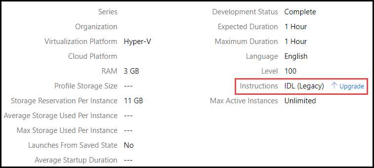

# IDL (legacy) to IDLx Migration Guide

Upgrading your lab to IDLx is simple, fast and easy. 

- Your lab can be reverted back at anytime
- If you upgrade to IDLx and make changes, then revert, the IDLx changes are not displayed in IDL (legacy)

## Uprading Your Lab to IDLx

First navigate to the lab profile that you wish to upgrade. 

1. Click _Upgrade_ next to Instructinos on the lab profile details page. 

    

1. A dialog will be presented, with two options for how you would like LOD to display tasks, screenshots, and videos in IDLx integrated instructions. 

    


- Show screenshots and videos
    - Inline (recommended): displays screenshots embedded into IDLx instructions.
    - As links: displays a link that the user must click to see the screenshot or video.

    

    _Image shown inline_

    

    _Image shown as a link_

- Migrate Task 
    - Text Only (recommended): shows the text of the task only
    - Name and text: shows the text from the tas, as well as the title.

    

    _Task shown with Text Only (recommended)_

    

    _Task shown with Name and Text_

3. Once you have upgraded your lab profile from IDL (legacy) to IDLx, be sure to check the following in the lab instructions. 

- Make sure all **emphasis (bold, italic) are displayed correctly**. 
    - If you see an out of place ```*``` or ```**```, a word may not be bolded or italicized. 

- Ensure **images and videos are displayed correctly**. 
    - If they are inline (not displayed as a link), and you want them to be a link instead, remove the ```!``` in front of the image or video syntax. Example: ```Image[Text displayed in instructions](startMenu.png)```.
    - If they are displayed as a link, and you want them to be inline instead, add the ```!``` in front of the image or video syntax. Example: ```!Image[](startMenu.png)```.

- **Knowledge and Alert boxes** are no longer separate actions that the user must click to see. These are inline in lab instructions. 
    - Ensure that they are dispalyed inline, in the proper location according to the lab instructions. I.E. ensure that an alert appears under the instruction that the Knowledge/Alert box is referring to. 

- Ensure **Code Blocks are displayed correctly**. Information that should be displayed in a code block should be wrapped with 3 backticks (key to the left of the number 1 on the keyboard).

- Ensure **number items are numbered correctly**. When using numbered lists of any kind, always use "1." for the number. Markdown natively supports auto-numbering when it is rendered into HTML. Using 1-dot numbering makes ongoing maintenance easier (inserting items in a numbered list does not require renumbering the list).

- **Before each excercise**, it is recommended to **add a page break** (```===```) to the lab instructions. This will add a _Next_ button that the user can click to advance to the next page in the lab instructions. 

    

- If you would like to utilize Track Task Progress, to keep track of the tasks that are completed, you must do the following. 

    - Enabled Track Task Progress in the IDLx instruction editor. This needs to be enabled **after** the lab profile is upgraded. 

    - Any lab instructions that will be tracked, and contribute to the overall percentage completed in the lab, must start with ```1. [ ]```. This will render in the lab instructions as a checkbox. When the student clicks the checkbox, it is added to the Tasks Completed bar in the lab, as well as the lab instance in LOD and TMS. 

    

4. To **cancel or exit** the lab, students will go to the hamburger menu, and choose the appropriate option. 

    

5. For a quick reference of Markdown syntax while authoring IDLx lab instructions, clicking the question mark icon in the lab instruction editor will open a quick markdown reference dialog. 

    

For more information on IDLx lab authoring, or Markdown, please see some of our Help articles. 

- [IDLx Authoring Guide](https://docs.learnondemandsystems.com/guides/idl2/idlv2-authoring-guide-and-best-practice.md)

- [Markdown User Guide](https://docs.learnondemandsystems.com/guides/idl2/markdown-user-guide.md)
