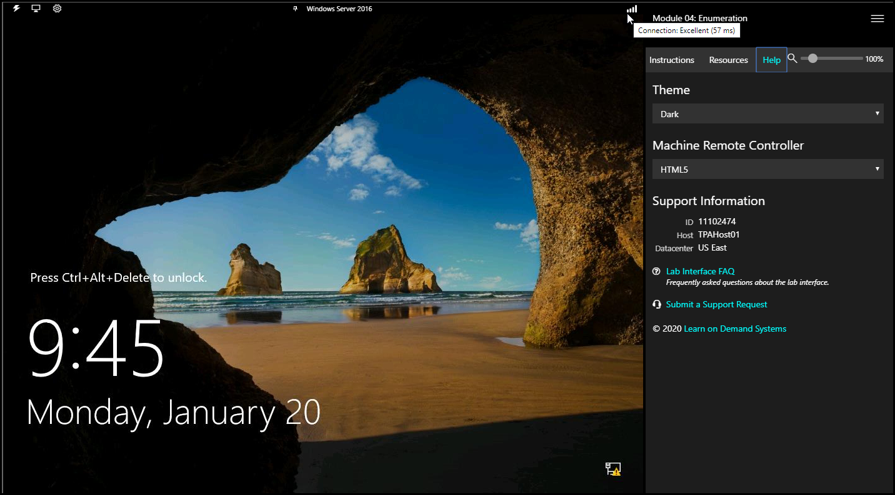

# How Can I See The Quality Of My Connection To My Lab?

If you are experiencing issues in your lab such as, **slow response time**, **lag in typing**, or **disconnections** you should check the quality of your internet connection to the lab servers. This information will let you know if there is something happening with your connection and will assist the help desk in identifying a possible cause.

# How Can I See The Quality Of My Connection To My Lab?

If you are experiencing issues in your lab such as, slow response time, lag in typing, or disconnections you should check the quality of your internet connection to the lab servers. This information will let you know if there is something happening with your connection and will assist the help desk in identifying a possible cause.

Just to the left of the title of the lab, you can see a visual representation using the ubiquitous “how many bars you got?” graphic of your connection at that very moment. It will look like several bars in increasing size. The more bars that are lit, the better your connection is at that moment. You can hover over it to see a summary of your connection quality and latency. 

>[!knowledge] 
>
> You can view your lab latency (measured in milliseconds) by hovering your mouse cursor over the connection bars in the lab. 
>
>- <= 60 milliseconds = Excellent (4 bars)
>- <= 150 milliseconds = Good (3 bars)
>- <= 240 milliseconds = OK (2 bars)
>- \> 240 milliseconds = Poor (1 bars)

This measures the network latency between your browser and the server where the VMs are hosted. This is the last latency value received from the your machine. Large latency numbers may cause your lab to seem sluggish or even non-responsive. The issue may be with your network, internet provider, the overall internet health, or the lab host. If any of the conditions persist, contact your help desk and provide them with this detailed information along with the **Support Information** on the **Support** tab.