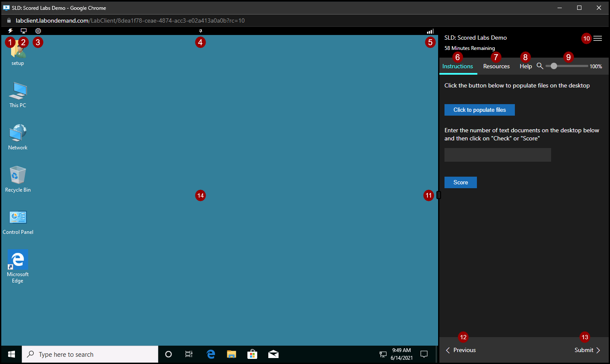
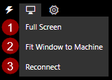

# Lab Interface 

The lab interface is displayed in two different configurations, depending on the lab components in your lab. 

- Virtualization based labs are displayed in a single browser window.
- Cloud based labs are displayed in two browser windows.

Within the lab interface, some buttons expand to display a menu of options. 

>[!alert] Some buttons or menus may not be available to you, depending on your account configuration. 

  - [Overview](#overview)
    - [Commands Menu](#commands-menu)
    - [Display Menu](#display-menu)
    - [Developer Menu](#developer-menu)
    - [Hamburger Menu](#hamburger-menu)

## Overview

1. **Commands menu**: Contains advanced lab functions. See the [Commands menu](#commands-menu) section for more information. 

1. **Display menu**: Contains display settings. See the [Display menu](#display-menu) section for more information. 

1. **Developer menu**: This is used to install integration services on the virtual machine in the lab. 

1. **Pin/unpin**: This allows pinning or unpinning the top bar that contains the Commands menu, Display menu, Developer menu and connection indicator. 

1. **Connection indicator**: Displays the connection quality between your local machine and the virtual machine in the lab environment. The connection quality is displayed in milliseconds and a description of Excellent, Good, Fair and Poor. For more information about each connection quality description, or conduct a speed test, please see our [Learn on Demand Systems Speed Test](https://www.learnondemandsystems.com/speedtest/).

1. **Lab instruction pane**: Displays the lab instructions. 

1. **Lab resources**: Contains lab resources such as virtual machines, cloud resources, and any credentials needed to complete the lab instructions. 

1. **Lab help**: Contains theme settings, lab instance ID, FAQ and a link to submit a support request. 

    **NOTE**: The Help tab may not be available to you, depending on your learning organization. 

1. **Lab instruction zoom slider**: This allows you to zoom the display of the each tab in the lab instruction window. 

1. **Hamburger menu**: Contains options to save the lab and return to it later, save changes to the virtual machines in the lab, edit instructions, share your lab instance, or transfer your lab instance to another user. See the [Hamburger menu](#hamburger-menu) section for more information. 

    **NOTE**: some of these options may not be available to you, depending on your account configuration. 

1. **Instruction resizer**: Drag left and right to adjust the size of the instruction pane. 

1. **Previous lab instruction**: Navigates to the previous page in the lab instructions. 

1. **Next lab instruction**: Navigates to the next page in the lab instructions.

1. **Virtual machine or cloud platform (depending on lab configuration)**: The virtual machine in focus, or the cloud platform (if the lab doesn't use virtual machines).

### Commands Menu 

>[!alert] The Commands menu is not available in labs that do not use virtual machines. 

1. **Ctrl+Alt+Delete**: Sends the Ctrl-Alt-Delete key combination to the virtual machine. 
1. **ALT+Tab**: Sends the ALT+Tab key combination to the virtual machine. 
1. **Windows Key**: Sends the Windows key command to the virtual machine. 
1. **Type Text**: Sends text to the virtual machine. 

    A. **Type Username**: Types the username into the virtual machine.

    B. **Type Password**: Types the password into the virtual machine.

    C. **Type Clipboard Text**: Opens a dialog box to paste text into from your local clipboard. 
    
1. **Power**:

    A. **Pause Machine**: This puts the virtual machine into a paused state. Once it is paused, it must be resumed to continue using the virtual machine. 
    
    B. **Reset/Reboot Machine**: This reboots the virtual machine. This **does not** gracefully shut down the machine. It is recommended to save your work before using this. 
    
    C. **Turn Off Machine**: This powers down the virtual machine. 

1. **Virtual Keyboard**: This enables an on-screen virtual keyboard that can be used to input keystrokes into the virtual machine. 

1. **Reset Internet Gateway**: Resets the gateway that the virtual machine uses to connect to the internet. 

### Display Menu 

1. **Full Screen**: Sets the lab to display in a full screen window. 

1. **Fit Machine to Window**: This resizes the virtual machine to fit the browser window. 

1. **Reconnect**: This will reconnect your local machine to the remote virtual machine, if the connection is interrupted. 

### Developer Menu 

1. **Install Integration Service**: This installs the Lab on Demand Integration Service. This allows automatic screen resizing (limited resolutions)
 and executing UI commands within a virtual machine. 
### Hamburger Menu 

1. **Save**:

    A. **Save my lab instance and return to it later**: This allows you to save your lab and return to it later. Please note the expiration date and time that is displayed after you save your lab. Once the expiration date and time has elapsed, the lab is cancelled and any work in the lab will be lost. 

    B. **Commit my changes to this lab profile**: This allows lab authors to commit changes to virtual machines in the lab, so that subsequent lab launches will contain those changes. 

    C. **Commit my changes and create a new lab profile**: This allows lab authors to commit changes to virtual machines in the lab and save a new lab profile with the changes. 
    
1. **Edit Instructions** This allows lab authors to edit the instructions that are displayed in the instruction pane of the lab. 

1. **Split Windows**: This allows splitting the windows into two separate windows; with the Virtual machine in one window, and the lab instruction pane in another window. 

