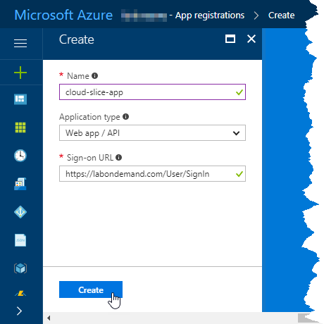
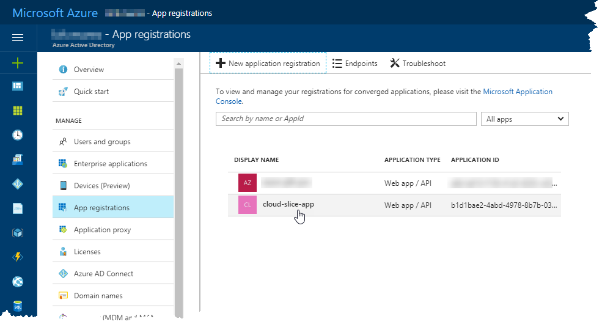
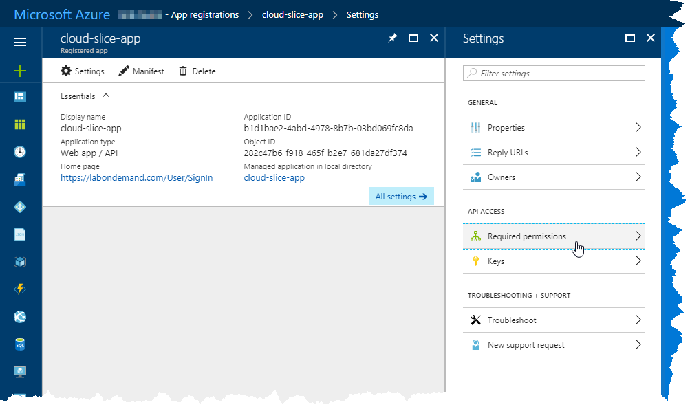
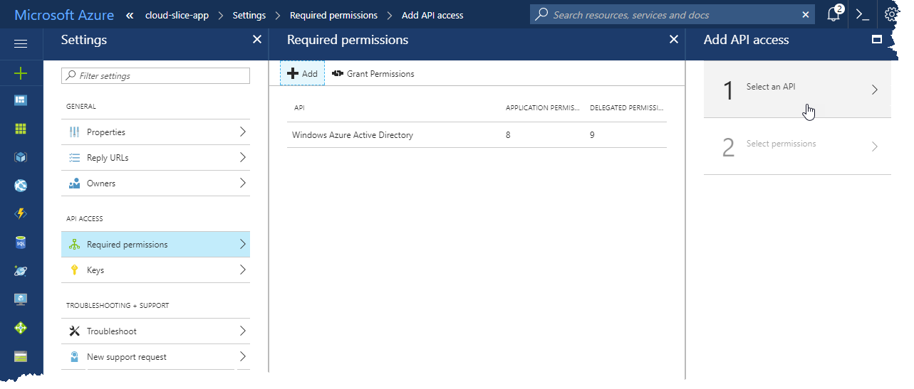
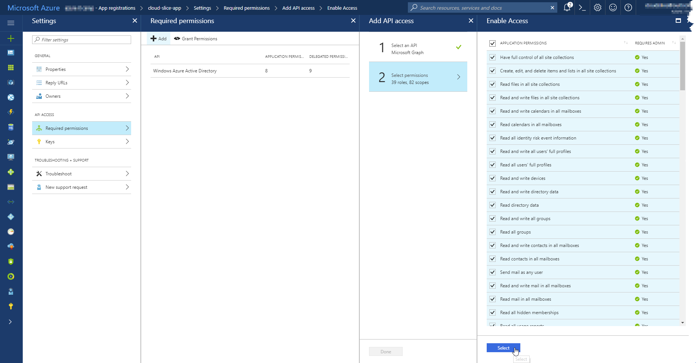
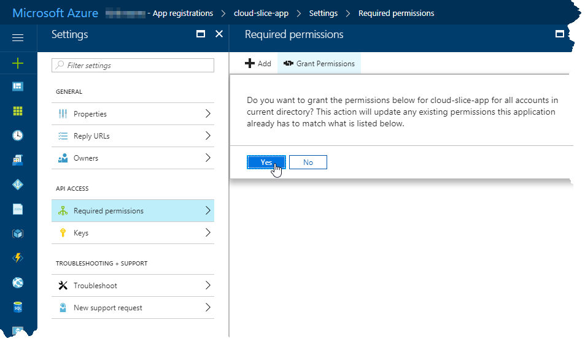
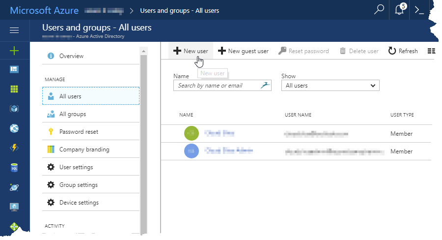
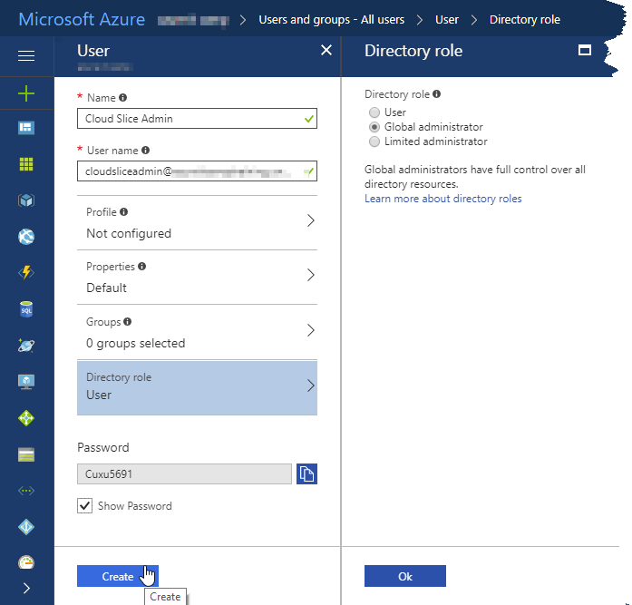
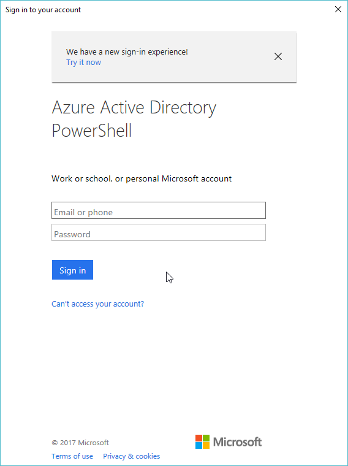
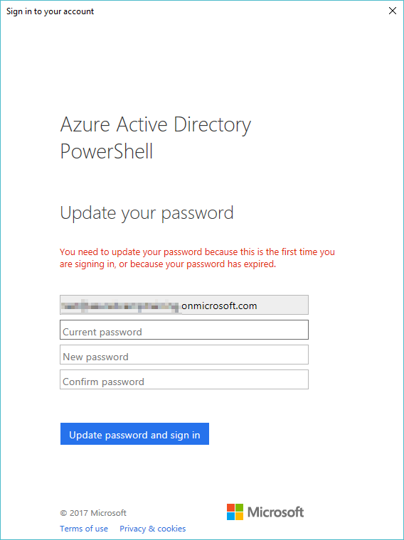

# Cloud Slice Quick Start - Configure Subscription - Microsoft Azure

Estimated time to completion: **20 minutes**.

To enable Cloud Slice support in a Microsoft Azure subscription, you must perform the following tasks:

1. [Create a new application registration in Azure Active Directory with a specific set of permissions][create-app-registration].
1. [Create an API key for the application registration and record subscription authentication details][create-api-key-and-record-authentication-details].
1. [Add the application registration as an owner to the Azure subscription][add-app-registration-as-owner].
1. [Assign Company Administrator role to the application registration for cloud slice user management][assign-company-administrator-role].

[create-app-registration]: #create-a-new-application-registration-in-azure-ad "Create a new application registration in Azure AD"
[create-api-key-and-record-authentication-details]: #create-an-api-key-for-the-application-registration-and-record-authentication-details "Create an API key for the application registration"
[add-app-registration-as-owner]: #add-the-application-registration-as-owner-to-the-azure-subscription "Add the application registration as owner to the Azure subscription"
[assign-company-administrator-role]:#assign-company-administrator-role-to-the-application-registration "Assign Company Administrator role to the application registration"

## Create a new application registration in Azure AD

The OneLearn Lab on Demand platform uses an application registration in Microsoft Azure Active Directory to provision resources required for each Cloud Slice. This includes providing students with user accounts that can access the resources allocated to them for the duration of their lab.

To create a new application registration in Azure Active Directory, do the following:

1. [] Open the <[Microsoft Azure Portal](https://portal.azure.com/), and sign-in with a subscription owner.
1. [] Open the <[Azure Active Directory App registrations blade](https://portal.azure.com/#blade/Microsoft_AAD_IAM/ActiveDirectoryMenuBlade/RegisteredApps).
1. [] With the App registrations blade open, click on **New application registration**. This will open a new blade from which you can create your new application registration.

    

1. [] In the Create blade, enter the following values into the fields provided, and then click **Create** to create the new application registration.

    |Field Name|Field Value|
    |--|--|
    |**Name**|++lod-cloud-slice-app++ (or any other name you prefer)|
    |**Application type**|Web app/API|
    |**Sign-on URL**|++https://labondemand.com/User/SignIn++|

    

1. [] Once the application registration has been created, select it in the list of application registrations. If your new application registration is not showing in the list of available application registrations, click on **Overview**, then on **App registrations** to refresh the list. Once you have selected the application registration, a new blade will open showing the application registration properties.

    

1. [] In the Settings blade, click on **Required permissions** to show the Required permissions blade.

    

1. [] In the Required permissions blade, select **Windows Azure Active Directory** (note: this may be renamed as Microsoft Azure Active Directory in the future). This will display the Enable Access blade. Ensure that all application and delegated permissions are checked in the Enable Access blade.

1. [] Once all permissions have been checked, click **Save** at the top of the Enable Access blade.

    

1. [] Now click **Add** at the top of the Required permissions blade to add additional permissions. Click **Select an API** and choose the **Microsoft Graph** API.

    

1. [] Click **Select permissions**, check all application and delegated permissions in the Enable Access blade, and then click **Select** to select those permissions.

    

1. [] Click **Done** to finish adding the Microsoft Graph permissions. Click **Add** and repeat this process to add the single permission included in the Windows Azure Service Management API. Once you have finished adding these permissions your Required permissions blade should look something like this:

    

1. [] Click **Grant Permissions** to grant the new permissions to the application registration. This will result in a confirmation message being displayed in the portal. Click on **Yes** to grant the permissions to the application registration. You may now close the Required permissions blade.

    

[Back to top][back-to-top]

## Create an API key for the application registration and record authentication details

Now that you have created and the application registration and granted it the required permissions, you need to create an API key for the application registration and record it for later. You will also need to record the application registration's application ID, the ID of the Azure subscription that will be used to provision Cloud Slices, and the Azure Active Directory domain name (this is commonly referred to as your tenant name). These four pieces of information are required by the OneLearn Lab on Demand authentication process in order for it to be able to provision Cloud Slices for your labs in this Azure subscription.

### Create application registration API key

To create an application registration API key, you need to be in the application registration blade for the application registration you created earlier. If you are following this guide in order, you should already be there. From the application registration blade, you must do the following:

1. [] Click on **Keys** in the Settings blade to create a new key.
1. [] Enter a description for the key in the **Description** field and select an appropriate duration for the key from the values in the **Expires** drop down list. You should only set the duration to something other than "Never expires" if you want to periodically change the key before it expires while you do not have any Cloud Slice labs that are using that key that are currently in use.
1. [] Click on the **Save** button to save the key. Take care not to navigate away from this view in the portal because you will need to be able to access the key that is displayed on save in the next step.


### Copy the application registration application ID and API key

Once you have the application registration key created, you need to copy both the application ID and the API key. You can only do this at the time when you create the key (see the steps in the previous section identifying how to create an API key). Perform the following tasks to copy the application ID and API key:

1. [] Hover your mouse over the copy glyph that appears at the end of the Application ID and click to copy that value. Paste it in a document or credential management application where you track credentials so that you can access it later. **Record this value as the Application ID**.
1. [] Select the text in the value field of the API key and copy it. Paste it into the same document or credential management application where you track credentials so that you can access it later. **Record this value as the Application Secret**.


### Copy the Azure subscription ID

To copy the Azure subscription ID for later, do the following:

1. [] Open the <[Subscriptions service](https://portal.azure.com/#blade/Microsoft_Azure_Billing/SubscriptionsBlade).
1. [] Select the value in the Subscription ID field of your Azure subscription and copy it. Paste that value into the same document or credential management application that you used earlier. **Record this value as the Subscription ID**. 

### Copy the Azure Active Directory domain name

To copy the Azure Active Directory domain name, do the following:

1. [] Open the <[Azure Active Directory Custom domain names blade](https://portal.azure.com/#blade/Microsoft_AAD_IAM/ActiveDirectoryMenuBlade/Domains).
1. [] Copy the domain name that you will use for your Cloud Slice subscriptions. Paste that value into the same document or credential management application that you used earlier. **Record this value as the Tenant Name**.


[Back to top][back-to-top]

## Add the application registration as owner to the Azure subscription

Once you have created the application registration and assigned appropriate directory permissions for that application registration, you need to add it as an owner of the Azure subscription from which you want to provision Cloud Slices by following these steps:

1. [] Open the <[Subscriptions service](https://portal.azure.com/#blade/Microsoft_Azure_Billing/SubscriptionsBlade).
1. [] Select the Azure subscription from which OneLearn Lab on Demand will create Cloud Slices.
1. [] Click on **Access control (IAM)** to open the identity and access management options for the subscription.
1. [] Click on the **Add** button to add permissions to the subscription.
1. [] In the **Role** drop down list, ensure that Owner is selected.
1. [] In the **Select** field, enter ++lod-cloud-slice-app++, or whatever other name you chose as the name of the application registration that you created for Cloud Slice management.
1. [] Select the application registration in the list of search results that are displayed.
1. [] Click on the **Save** button at the bottom of the Add permissions blade to save the permissions you have selected.


[Back to top][back-to-top]

## Assign Company Administrator role to the application registration

 The last step you need to take is to grant the Company Administrator role role to the application registration that you created earlier. This role can only be granted by a global administrator, and it must be granted using Windows PowerShell.

### Create a global administrator

If you do not yet have a global administrator set up in your subscription, create a new global administrator account by doing the following:

1. [] Browse into the Azure Active Directory service, and click **Users and Groups**.

1. [] Click **All users** to show all users in the directory.

1. [] Click **New user** to create a new user. This will open the New user blade.

    

1. [] In the New User blade, configure the new user account using the information provided below. Then click **Create** to create the user.

    |Field Name|Field Value|
    |--|--|
    |**Name**|++Cloud Slice Admin++|
    |**User name**|Enter "cloudsliceadmin@_domainName_.onmicrosoft.com", replacing _domainName_.onmicrosoft.com with the Tenant Name that you recorded earlier.|
    |**Directory role**|Select **Global administrator**, then click **OK**.|
    |**Show Password**|Check this field, then click the copy button to the right of the field to copy the default password that has been assigned to the new user. Paste this into the document where you have  been recording other details, and note that it is the default password for the new Cloud Slice Admin user account.| 

    

### Grant Company Administrator access to the application registration

Now that you have a global administrator account you can use, you need to use Windows PowerShell to add the Company Administrator role. To accomplish this task, do the following using Windows PowerShell 5.0 or later (Windows PowerShell 5.0 or later are installed by default on Windows 10 and Windows Server 2016 or later):

1. [] Open Windows PowerShell on your local computer as administrator.

1. [] Invoke the following command in Windows PowerShell:

    ```powershell
    Get-InstalledModule -Name AzureAD -ErrorAction Ignore
    ```

    If that command did not return anything, then you need to install the AzureAD module by invoking this command:

    ```powershell
    Install-Module -Name AzureAD -AllowClobber
    ```

    Otherwise, if `Get-InstalledModule` returned the AzureAD module, make sure you have the latest version by invoking this command:

    ```powershell
    Update-Module -Name AzureAD
    ```

1. [] Once the AzureAD module has been installed/updated, invoke the following command to log on to AzureAD using your global administrator:

    ```powershell
    $cloudTenant = Read-Host -Prompt 'Enter the name of your tenant'
    Connect-AzureAD -TenantId $cloudTenant
    ```

    When you are prompted to enter the name of your tenant, enter the Tenant Name that you recorded earlier. This will be in the format "_domainName_.onmicrosoft.com". Once you have provided that information, you will be presented with an Azure Active Directory PowerShell login dialog. Enter the username and password for the global administrator account you will use to assign the Company Administrator role to the application registration, and then click **Sign in**.

    

    If you created a new global administrator account and you are signing in with that account for the first time, you will be presented with second dialog to update your password. Enter the current password (the one you copied earlier) for your new global administrator account, and then enter a new password twice to change that password. Click **Update password and sign in** once you have finished. This will return you back to your Windows PowerShell prompt.

    

1. Invoke the following commands to retrieve your application registration object, retrieve the Company Administrator role, and add the Company Administrator role to your application registration.

    ```powershell
    $appRegistrationId = Read-Host -Prompt 'Enter your Application ID'
    $appRegistration = Get-AzureADServicePrincipal -All:$true | Where-Object AppId -eq $appRegistrationId
    $companyAdminRole = Get-AzureADDirectoryRole | Where-Object DisplayName -eq 'Company Administrator'
    Add-AzureADDirectoryRoleMember -ObjectId $companyAdminRole.ObjectId -RefObjectId $appRegistration.ObjectId
    ```

    When you run this command, you will be prompted to enter your Application ID. This is the ID of the application registration that you recorded earlier.

**If you made it this far, you have successfully added the Company Administrator role to your application registration. Congratulations!**

[Back to top][back-to-top]

## Review Checklist

By now you should have completed the following using one or more Azure subscriptions:

- Created an application registration in Azure Active Directory.
- Assigned the required permissions to that application registration.
- Added the application registration as owner to an Azure subscription.
- Added the Company Administrator role to the application registration.

You should also have captured the following pieces of information for each Azure subscription you are using for Cloud Slice deployment:

- Azure subscription ID
- Azure Active Directory domain name
- Azure application registration application ID
- Azure application registration API key

These values are required for the OneLearn Lab on Demand platform to be able to provision Cloud Slices for your labs. If you are missing one or more of those values, or if you feel you did not complete one of the tasks listed above, review the steps in this document to find out what you missed.

Now that you have configured your cloud subscription properly, click on the link below to go through the next Quick Start where you will add your cloud subscription into LOD.

[Add Subscription into LOD Quick Start](add-subscription-into-lod.md).

[Back to top][back-to-top]

[back-to-top]: #cloud-slice-quick-start-configure-subscription-microsoft-azure "Return to the top of the document"
