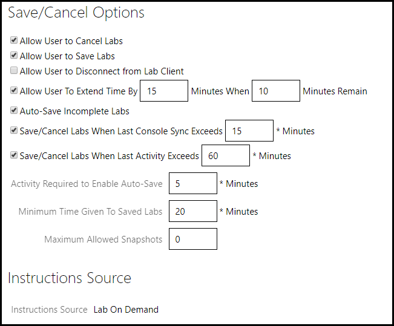
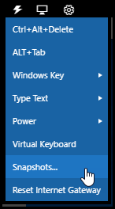

# Snapshots

Snapshots allow students and instructors to set a restore point in their lab instance. Once a snapshot is created in the lab instance, the lab can be rolled back to this point in time. Please note that snapshots are deleted when a lab instance is cancelled or no longer running.

 Lab content should be written in such a way that enabling the snapshot feature is avoided. As a lab author, you may find that it would be better to modularize the content within your lab, breaking it up into a number of smaller, more consumable lab profiles.

The snapshot itself applies only to tasks carried out against the virtual machines contained within the lab environment. Any work performed outside the environment, through a website or in a cloud environment, will not be part of the snapshop.

## Enabling Snapshots on the Lab Profile

Lab authors may allow snapshots per lab profile by setting the value for **Maximum Allowed Snapshots** under the **Advanced** tab on the lab profile edit page. Between 0 and 10 snapshots can be configured in this field, with 0 disabling the feature. 

## Creating and Utilizing Snapshots

When enabled, a student may create a snapshot by selecting "Snapshots..." from under the commands menu(lightning bolt) in the top left corner of the lab client. 

The snapshot menu will allow you to save a new snapshot by entering a name and selecting "Create Snapshot". Existing snapshots can also be applied or deleted from this screen. Simply choose your prefered action next to one of the snapshots listed.

