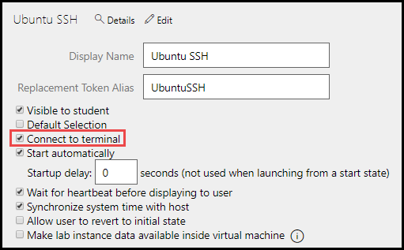

# Terminal Access to Virtual Machines


SSH Terminal access allows a user to connect and interact with a virtual machine from a terminal window.

There are several virtual machine (VM) requirements for SSH terminal access. 

- Install Hyper-V Integration. 
- Support ESX open-vm-tools. 
- A running SSH server on the VM.

For more information about how SSH works, and instructions on setting up an SSH server, click [here](https://www.tecmint.com/install-openssh-server-in-linux/).

## Installation

1. **For VMs hosted on Hyper-V**
    - Download Hyper-V Integration Tools. This can be downloaed [from Microsoft](https://www.microsoft.com/en-us/download/details.aspx?id=55106).
    - Once the file is downloaded, open the file to install Hyper-V Integration Tools.

1.  **For VMs hosted onOn ESX**, 

    - Linux VMs must support the open-vm-tools package. On most builds, this is installed by default. It is recommeneded to verify this is installed using the following commands: 
        - On **Debian/Ubuntu** builds this can be installed with ```sudo apt-get install open-vm-tools```.
        - On **RHEL or CENTOS** ```sudo yum install open-vm-tools -y```.

## Configure a running SSH server. 

SSH configuration may need to be modified to enable password authentication or root login.

1. Open ```/etc/ssh/sshd_config``` and uncomment the line_**PasswordAuthentication** yes_ 

1. If you need root login as well, uncomment **_PermitRootLogin yes_**, or add the line if you can’t find it. 

1. Make sure the SSH service auto boots. On most versions of linux can be done by entering the following command: ```sudo systemctl enable ssh```.

1. Start the service with the following command: ```sudo systemctl startssh```.

1. Once this is done, capture a differencing disk. 

1. In LOD, edit the lab profile and on the **Virtual Machines tab**, check the **_Connect to terminal_** checkbox for the VM you performed the above steps on. 

    

1. Launch a new instance of your lab profile and verify the VM connects via SSH. The VM should boot to a terminal window.

## Additional Resources

- [Best Practices for running Linux on Hyper-V](https://docs.microsoft.com/en-us/windows-server/virtualization/hyper-v/best-practices-for-running-linux-on-hyper-v)
- [Hyper-V (LIS) On Ubuntu 18.04](https://oitibs.com/hyper-v-lis-on-ubuntu-18-04/)
- [Supported Linux and FreeBSD virtual machines for Hyper-V on Windows](https://docs.microsoft.com/en-us/windows-server/virtualization/hyper-v/supported-linux-and-freebsd-virtual-machines-for-hyper-v-on-windows)
