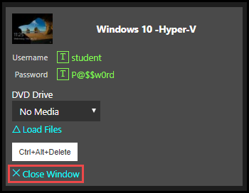
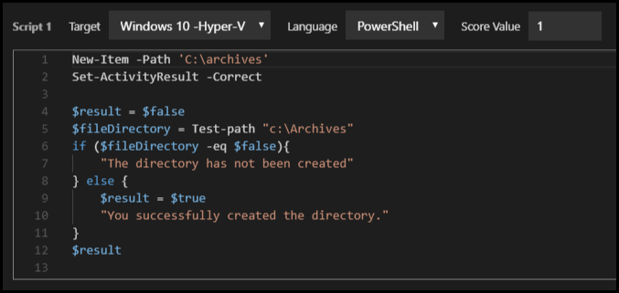
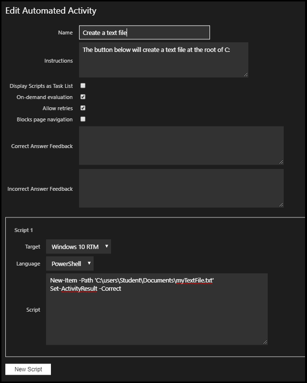
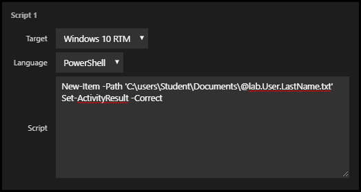

# What's New in Lab On Demand


## Released March 1, 2019

### **Custom Access Control Lists**

- Custom Access Control lists (ACL) are used to restrict and allow domains that can be access by the VM broswer in the lab. This is accomplished using blacklists and whitelists. Domains added to the blacklist will not be resolvable, and domains added to the whitelist will resolve. You can also allow or deny domains based on  expressions. 

- Access Control Lists are created by clicking the Access Control Lists link on  the Virtual Machine tab in LOD. ACL can be configured to a lab by editing the lab profile, and adding the ACL on the Network tab. ACLs are only available on Web Access (NAT) network types.

### **Performance and Reliability Improvements for Azure and AWS Cloud Slice**

- Various improvements have been made to increase performance and reliability of Azure and AWS Cloud Slice labs. 

## **Released February 8, 2019**

### **Open VMs in a separate window**

- VMs can now be opened in a separate window from the main lab window. Each VM in the lab can be displayed in its own window. From the Reources tab, clicking _Open in new window_ will open the VM in a new window. Clicking _Close window_ will close the VM window and put the VM back in the main lab window.

 

_VM is in main lab window_



_VM is in separate window_

### **IDLx Audio Syntax**

- New syntax to use mp3 audio clips in IDLx lab instructions. The new syntax will embed an audio player, or a link to the audio. 


_embedded audio player_


_audio as a link_

### **Other**

- When a student extends the lab timer, a note is added to the lab instance. 

### **Bug Fixes**

-  Fixed a bug that caused the lab timer to be hidden when set to display, in Cloud Slice labs. 
- Fixed a bug that prevented IDLx images from being resized properly due to case sensitivity in the syntax.
- Fixed a bug that caused GitHub integration to fail. 
- Fixed a bug that prevented images from opening in a dialog when IDLx windows are split.

## **Released January 18, 2019**

### **Show Scoring Result Upon Completion** 
- Allows lab authors to specify if the lab will display pass/fail and the number of correct when submitting a lab for grading. If the lab author chooses to not display pass/fail and the score, the message simply says the lab has been submitted for grading. 

This can be set in the Activities menu in the IDLx instruction editor.


_Show scoring result enabled_


_Show scoring result disabled_

### **AWS Login Rework**
- Allows a lab user to launch a lab and go directly into the AWS portal, without the need to enter AWS credentials. 

### **IDLx intuitive monitoring**
- Zoom level is now stored on the server.
- Zoom level is automatically restored when a student reconnects/reloads  -or save/resumes. 
- Monitor will see zoom level changes in real-time with no need t - refresh.
- Scroll position within the instructions tab is now stored on the server.
- Scroll position is automatically restored when a studen -reconnects/reloads, or save/resumes.
- Monitor will be scrolled to match the student's page location i -real-time with no need to refresh.

**Bugfix**
- We now prevent SCSI adapters from conflicting with SCSI disks in VMware based labs - VMware VMs shouldn't allow SCSI adapter and Disk to use same Device ID. Device ID 7 has been removed from availability. 

## **Released November 16, 2018**

### **Shared Labs Scalability Improvements**

- **Shared labs can now span across our entire datacenter fabric, including cross-platform deliveries.**

    - Shared environments can be an order of magnitude larger than before.
    - Scheduling/planning requirements have been dramatically reduced.
    - VMs can be hosted on Hyper-V and ESX servers within the same shared environment.


### **Lab Client Multi-Language Support**

- **Support for Spanish, German, French, and Portuguese in the lab client**

Set the lab to the language of choice, and our lab client will run in that language. The lab must be authored in the target language, if you would like the lab instructions to be displayed in the target language. 

### **Activity Based Assessment Script Editor**

- **Full Screen**

The activity script editor can now be viewed in full screen, allowing the lab author to see more of the script, without needing to scroll. 

- **Code Highlighting**

Code is now highlighted in the script editor, making it easier to identify script syntax, as well as @lab replacement tokens. 



- **@lab Token Completion**

Replacement tokens are not auto-completed for your convenience, making it easier to include @lab replacement tokens in lab instructions. 

- **@lab Variables**

Variables can now be set in lab activities, using the below syntax. Variables can be used by a second script in the activity, or a later activity in the lab. Variables set in a lab activity can even be referenced in lab instructions.

```Set-LabVariable -Name NameHere -Value ValueHere``` 

- **Real-Time Activity Script Editing**

This allows the lab author to keep the script editor open, while making live edits and executing inside the target environment. This dramatically speeds up script authoring and debugging. 

Automatic Special Character Conversion
When pasting into ABA script editors from rich editing applications such as Microsoft Word and OneNote,  characters such as emdashes, curly quotes, and non-breaking space characters are automatically converted into script-friendly alternatives. This can save hours of frustration when authoring scripts because bad characters typically look fine to the author, but cause scripts to fail to execute.

### **Hyper-V Activity Based Assessment Enhancements**

- **No Login Required to Run Scripts**

Automated Activity scripts can now be executed against a Hyper-V VM, without needing to log in to the VM. This allows hidden Scoring Bots to be inserted into labs. 

- **Lab Notifications from Activity Scripts**

Automated activity scripts can send a popup notification to the students lab, by using the below syntax. @lab replacement tokens can be used in notifications, to make the message more personalized for the student. @lab variables can also be used in lab notifications. 

```Send-LabNotification -Message "Hello @lab.User.FirstName!"```

- **Partial Scoring**

An automated activity can contain multiple scripts. A score value can now be given to each script in an activity, and when executed successfully will give the student that score value. This allows students to receive partial score for completing tasks within a single automated activity. This also allows the student to receive different amounts of points for each script, rewarding them more for difficult tasks. 


### **Organization Custom Support HTML**

- **Custom Support Information**

Organizations in LOD now have the ability to provide custom support information within the lab client. This can be configured on the organization profile in Lab on Demand (LOD). 

### New IDLx Syntax

- **Copyable TypeText**

Copyable/TypeText syntax: placing four + symbols on each side of any text, will make the text type into a VM, as well as copy to the clipboard when clicked. 

```++++enter text here to type into the VM and copy to the clipboard++++```


## **Released October 19, 2018**

### **VMware Improvements**

- **VMware Windows VM Automated Activity Support**

This feature allows lab authors to use PowerShell and shell scripts in IDLx automated activities to target Windows virtual machines running on VMware. These scripts can be triggered in the lab, by a lab user clicking a button on the Activity in the lab instructions. 



- **Ability to Target VMware with Life Cycle Action Scripts**

This feature allows lab authors to target virtual machines running on VMware with PowerShell scripts, using a Life Cycle Action. A script can be configured to run at a specific event during the life cycle of the lab. For example, a script could be written in a life cycle action to create a text file once the lab is running, and then another script in a separate life cycle action to print the IP address of the VM to the text file once the IP address is assigned. These scripts can even be configured to trigger in the background with no UI. 


### **IDLx Activities**

- **Automated activities Can Now Use @lab Variable Replacements in Scripts**

This allows lab authors to use @lab variables in automated activity scripts. For example, a script could be written to create a file with the lab users first name by placing @lab.User.FirstName as the file name. 



- **Automated Activities Can Now Send Notifications and Set Lab Variables**

This allows lab authors to set a variable in an automated activity script using PowerShell, and then use that variable later in the script, or in another automated activity script, to target VMware, AWS, and Azure.


- **Automated Activity Output**

We now optionally store automated activity output separately from a script message. This allows an author to say one thing in the lab instructions, yet leave more detailed evidence for reporting/remediation. Detailed evidence is store on the lab instance page. In the below script, the student will only see "you got it!" in the lab, while the list of VM services are captured on the lab instance details page. 


_view from the lab_


_view from the lab instance details page_


### **Life Cycle Action Improvements**
 
- **Life Cycle Actions Can Now Use @lab variable Replacements**

Life Cycle Actions can now use @lab replacement tokens in PowerShell and shell scripts. The script will not be triggered until the event that is configured in the Life Cycle Action. Life Cycle Actions can also use @lab replacement tokens in notifications.

- **Life Cycle Action Blocking**

This allows you to block further execution of the lab life cycle until the action completes. You can use this to sequence actions that depend on each other. 

In the image below, the first Life Cycle Action (LCA) sets the variable and is blocking. The second LCA uses the variable set in the first LCA to send a notification to the lab, and uses an @lab replacement token to show the student's first name. Setting the first LCA to block, allows the variable to be set before the second LCA attempts to use the variable. 


